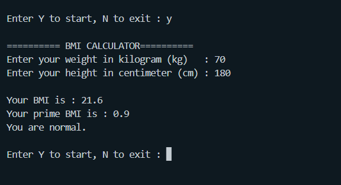

# BMI-Calculator-Python
This tool is a bmi calculator using the python language, made using loops so that calculations can be done many times

### What is BMI?
BMI is a number calculated from a person's weight and height. BMI provides a fairly reliable indicator of body fatness for most people and is used to screen for weight categories that may lead to health problems.

### What is BMI Prime?
BMI Prime is a ratio of a person's BMI to the upper-level weight limit of “healthy weight”. It is intended to give a quick answer to how far an individual differs upper weight limits, as well as an easy comparison between people whose upper BMI weight limits are different.

 

## Project Documentation
### BMI Reference
The table image below is for bmi evaluation for this python bmi calculator program

    

### Program Documentation When Executed
The picture below is how this bmi calculator program can run.
User will be asked to enter weight and height

    

There is an output string "Enter Y to start, N to exit : ". If the user enters "Y" then the program will continue to be executed, if the user enters "N" then the program will stop running.

 
 

## Credits
Most of the work has been completed by [Alt5chm3rz](https://github.com/satriobintang) (SatrioBintang) 
>I hope this project can be useful for many people. -Alt5chm3rz
